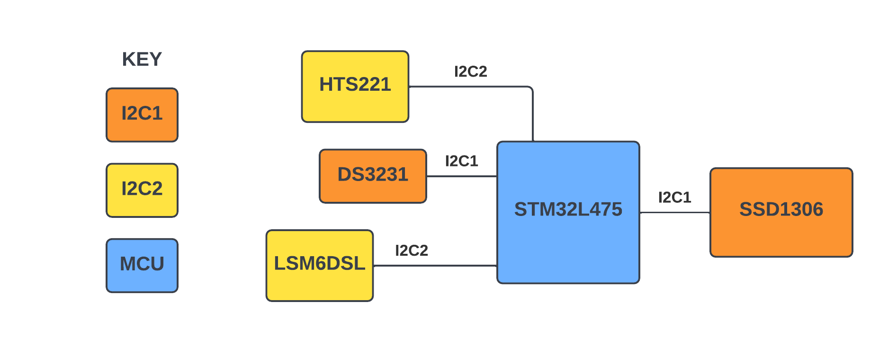
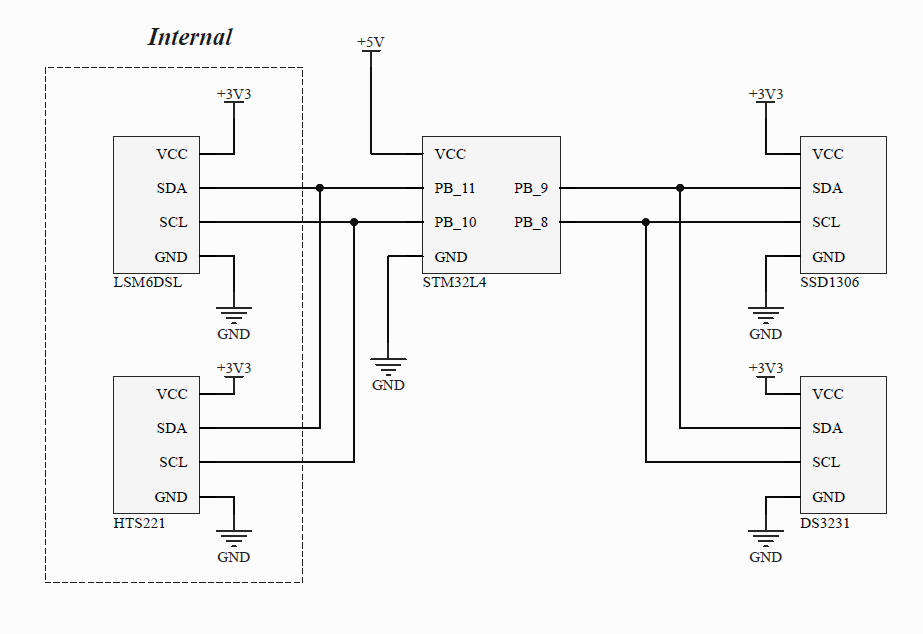

# clarkej12-coursework

## 1 - Embedded System Proposal
The proposed embedded system designed for the coursework is a watch. The watch will use a display to show different sensor readings, along with the date/time. From the user's perspective the watch will have a default screen, showing the date and time, along with different readings from the selected sensors (listed in the Hardware Design section). 

When the system is running correctly, the display should update the time displayed in real time. The other sensors can be updated at different a different rate, based on their priority level. To keep to the strict timings, the mbed os rtos is used. In addition, using the position of the watch, the display will turn on or off. For example, if the watch is by the side of the person the screen can't be seen, so the display should be turned off. 

For each of the sensors reading the datasheet, can provide a way to know if the system requirements are met. For example, writing and reading to the real time clock (RTC) module, and displaying that the time is correct, will indicate that the module is correctly set up. As the rtos is used to schedule when a thread should be run, the impact can be visually seen on the display. If the priority is incorrect, then readings won't be shown correctly, or at all if a thread is taking all the resources.

## 2 - Hardware Design
From the perspective of the hardware, the block diagram is shown below. All the sensors and display use I2C, being the SSD1306 OLED display, DS3231 RTC, LSMDSL accelerometer/gyroscope and the HTS221 temperature/humidity sensor.

### Components

* [STM32L475](https://www.st.com/en/microcontrollers-microprocessors/stm32l475vg.html) - [B-L475E-IOT01A](https://os.mbed.com/platforms/ST-Discovery-L475E-IOT01A/) is the development board used for this project. This an IoT board, that uses a STM32L4 microcontroller and has many on-board peripherals. The STM32L series are targeted towards low powered designs, which is perfect for this project.

* [SSD1306](https://cdn-shop.adafruit.com/datasheets/SSD1306.pdf) - OLED display used to provide the user with information via I2C1. The display shows the date and time from the DS3231, the step count from the accelerometer, as well as the temperature and humidity.

* [DS3231](https://datasheets.maximintegrated.com/en/ds/DS3231.pdf) - Real time clock (RTC) module, that uses the I2C1 protocol. The RTC provides the user with the date and time, and can be set in code if needed. This module is very simple to develop a driver for, after reading the datasheet. The registers written to need to be converted to binary coded decimal (BCD) and reading from the registers needs to be converted from BCD.

* [LSM6DSL](https://www.st.com/en/mems-and-sensors/lsm6dsl.html) - A 3D accelerometer and 3D gyroscope, that comes on-board the B-L475E-IOT01A. The accelerometer is used to track the number of steps that the user does. This is done by using the built-in pedometer/step counter feature. The communication protocol used with this sensor is I2C and is connected to I2C2.

* [HTS2221](https://www.st.com/resource/en/datasheet/hts221.pdf) - A capacitive digital sensor that can measure the relative temperature and humidity. This sensor is on-board and is connected to I2C2.

### Schematic Diagram

## 3 - Embedded Code Implementation and Architecture
The whole system is designed based on the rtos. Using a rtos allows each thread to run when needed and priorities what is important. For example, the DS3231 needs to be read every second and be displayed. If this wasn't done, then the clock on the display would show the incorrect time and will second readings.

There are a total of four threads, each given a priority:
* displayThread(osPriorityNormal) - The display thread has the lowest priority out of the threads used. Although the display does need to be updated, this can be done when the other threads are sleeping. To update the display, at least 15 milliseconds was needed, otherwise a higher priority task would have switch context and caused the display to malfunction.
* stepThread(osPriorityAboveNormal) - Shared with the same priority as the humidity and temperature sensor, this thread is used to get a reading from the step counter. The difference in timing between these two threads are how long the thread goes to sleep. The stepThread, sleeps for less time than the hum_tempThread, as the longer the time between readings the less chances of seeing small changes in the steps.
* hum_tempThread(osPriorityAboveNormal) - Reading the humidity and temperature is set to a lower priority. The readings of these are not critical, and small changes in the environment can be missed without impacting the system. When not in use, the thread goes to sleep to allow the lower priority task to run, in this case the display thread.
* ds3231Thread(osPriorityRealtime) - The RTC module has the highest priority. As mentioned above, the needs to be read every second for the display to show the correct time. When not in use the thread will go to sleep, to allow the lower priority tasks to run.

Although not implemented, the choice of picking the STM32L4 board was due to the low power it provides. The 'L' series of STM32 microcontrollers are designed to be used in ultra-low power applications. The lower power mode for the STM32L4 microcontroller used, can go as in the range of  nano-amps when in ultra-low-power mode. Comparing this to an STM32F4 microcontroller, this goes down to micro-amps.

### Libraries

Although a library can be found for the DS3231 rtc module, the library for that was created from scratch (DS3231.h and DS3231.cpp). The other libraries used to interface with the board are sensor was taken from the PlatformIO library being the LSM6DSL, HTS221 and Adafruit_SSD1306 libraries.

## 4 - Evaluation
Overall, the system works, and everything that was implemented was done to a suitable degree. Each sensor used can display their readings on the OLED screen. The rtos used updates the display periodically with no jittering.

With some of the features there have been a few issues along the way. The biggest issues are with the SSD1306 display. The library used for the SSD1306 has many of the original features taken out, for example having the text scroll across the screen. Trying to add sprites to the display was also troublesome, as the sprites created e.g., symbol of a footstep, did not display correctly despite changing a lot of the original library. There is also an issue of the display not clearing it's buffer after a reset, and to work around this the power for the display needs to be turned off then on.

A user button was supposed to put the watch to sleep and wake up when pressed, via an interrupt. However, trying to use an interrupt with the rtos was not as simple. After reading posts, it's because the rtos will generate its own interrupt periodically from the Systick timer ([post mentioning this](https://os.mbed.com/questions/2201/mbed-sleep-problem-with-RTOS/)), which made the watch constantly wake up after being put to sleep. There should be a work around for this, and with more time the sleep and wake up function feature could have been implemented.
